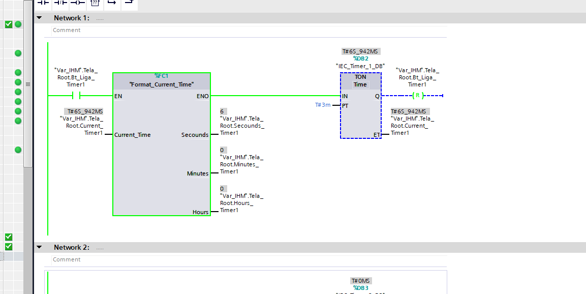
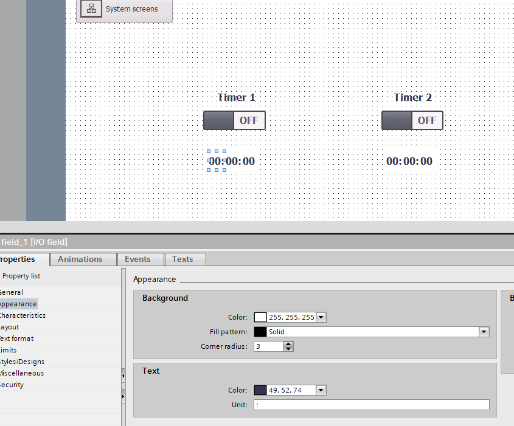
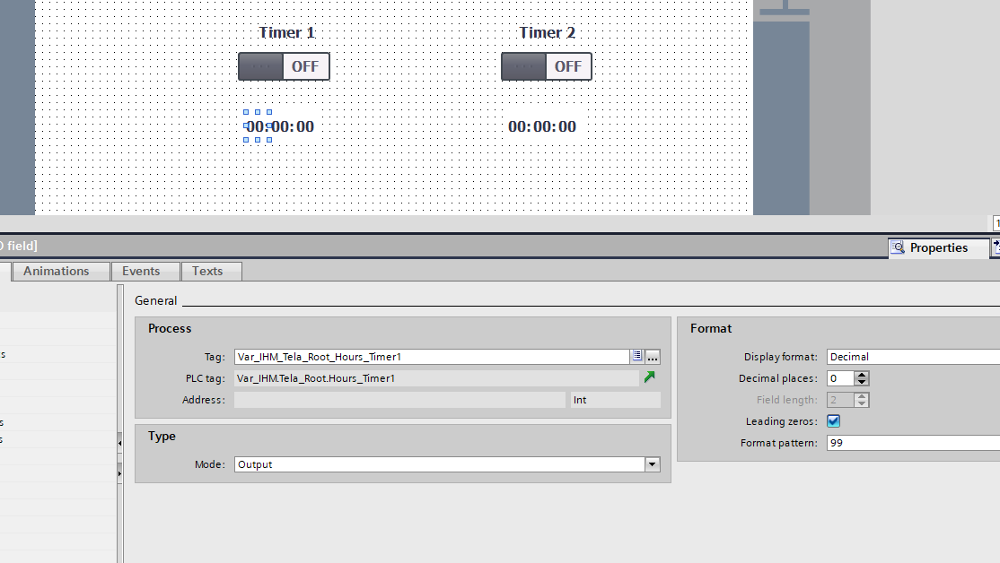
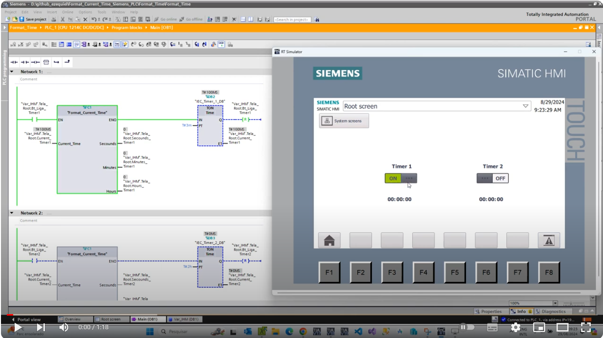

# Format Current Time

O objetivo deste projeto exemplo é apresentar uma FC que criei para formatar o tempo corrente dos temporizadores da Siemens, no padrão HH:MM:SS.

<!-- Inserir imagem com a #vitrinedev ao final do link -->

Elaborado por Ezequiel da Silva Daniel

[Blog](https://ezequieldaniel.wordpress.com/)  
[Email](ezequielsd@gmail.com)

  

## Apresentação

Parece algo tão simples né e básico, mostrar um tempo correndo na tela para orientação do operador, mas nas IHM da série Basic Panel, é algo de outro mundo. 
Não tem uma forma de formatar isso. Vi em uma postagem no Fórum da Siemens que no V18 para as Unified, é possível realizar a formatação de forma em String, como fazemos em desenvolvimento de software, mas eu não testei ainda.
Bom por este motivo eu criei essa FC, onde é passado o Current Time, no tipo time, e a FC devolve os segundos, minutos e até horas, fracionados em números inteiros. Ai só montar na tela.

## Requisitos

O projeto foi desenvolvido no TIA PORTAL V18.

## Como utilizar

Basta incorporar a FC localizada na pasta FCs ao seu projeto, podendo ser arrastado para outr TIA aberto, ou usando esse projeto como base para desenvolver o seu.
O bloco possui:

**IN**

* Current_Time : Entrada que deve ser parametrizada com o ET do temporizador, do tipo time.

**OUT**

* Secounds: Fornece o valor em segundos, no tipo Int.
* Minutes: Fornece o valor em minutos, no tipo Int.
* Hours: Fornece o valor em horas, no tipo Int.

Deve ser associado a estas saidas registros, para que os mesmos sejam utilizados nos tags para IHM.
Na IHM, basta colocar um objeto do tipo **IO FIELD**, para cada parte, conforme necessidade, um IO com dois digitos para segundos, outro com dois digitos para minutos e outro para hora, se for necessário.
Adicione na aparencia deste FIELD uma unidade, ":" como divisor. 
Neste projeto você poderá observar como foi feito a parte da IHM.

<!-- Inserir imagem com a #vitrinedev ao final do link -->

<!-- Inserir imagem com a #vitrinedev ao final do link -->

## Pacotes de terceiro

N.A.

## Autor

Ezequiel da Silva Daniel  

## Licença

[MIT]

## Release

A versão Release do programa. Se preferir pode pegar na pasta "Aquivado" o programa no formato compactado do TIA, em tamanho menor.

